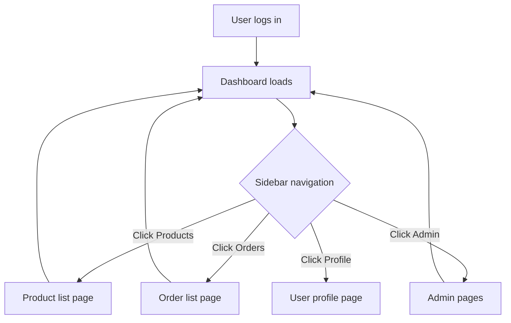

# Pages Dashboard

## Purpose
The main landing page after login. Provides a high-level overview of system activity, quick navigation to key modules, and user context information. The dashboard is the central hub from which users access all ERP functions.

---

## Simple Instructions *(for non-developers)*

### What is this?
This is the main screen you see after logging in. It shows a welcome message, your current tenant and role, and gives you quick links to the most common tasks. The sidebar on the left lets you navigate to all parts of the system.

### What can you do here?
- See your username, role, and current tenant
- Use the sidebar menu to navigate to any module
- Access your profile and preferences
- Switch between tenants (if you have access to multiple)
- See quick links to common actions

### How to use it
1. After logging in, you land on the **Dashboard**.
2. The **sidebar** on the left shows all available modules.
3. Click any menu item (e.g., **Products**, **Orders**, **Admin**) to go to that section.
4. Your current tenant and role are shown at the top of the sidebar.
5. Click your **profile icon** to access settings or log out.

### Diagram

### Common issues
| Problem | Solution |
|---------|----------|
| Sidebar is empty or missing items | Your user role may not have access to any modules. Contact your system admin. |
| "You do not have access" error | Some pages require specific roles (e.g., sys_admin for Admin pages). Switch to a different user. |
| Wrong tenant shown | Use the **Switch Tenant** option in the sidebar or profile menu. |

---

## Key Classes *(developers)*

| Class/File | Role |
|-----------|------|
| `DashboardPage.tsx` | React component — renders the main dashboard view |
| `RouteLayout.tsx` | Layout wrapper — sidebar + header + content area, renders all pages |
| `uiStore.ts` | Zustand store — manages sidebar collapsed state, active menu item |
| `authStore.ts` | Zustand store — current user info, tenant context, permissions |

---

## Dependencies
- `authStore.ts` — provides user info, current tenant, permissions for menu filtering
- `uiStore.ts` — sidebar state (collapsed/expanded)
- `AppRoutes.tsx` — route definitions for sidebar menu items
- `RouteLayout.tsx` — shared layout with AppBar, Drawer, and content area

---

## Related Backend
- `backend-auth.md` — user login/context
- `backend-context.md` — tenant context resolution
- `backend-identity-admin.md` — user/role/tenant admin
