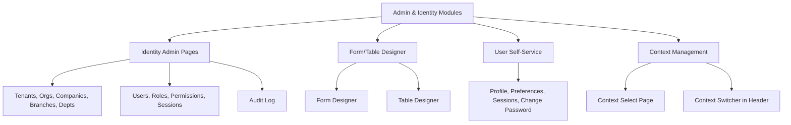

# Admin & Identity Modules

## Purpose
Frontend admin pages for identity management (tenants, orgs, companies, branches, depts, users, roles, permissions, sessions, audit), admin form/table designers, and user self-service pages (profile, preferences, sessions, change password, context selection).

---

## Simple Instructions *(for non-developers)*

### What is this?
These are the administration screens and user management pages. Administrators use them to set up the system — add users, create roles, manage companies — while regular users manage their own profile and preferences.

### What can you do here?
- **Admin:** Manage tenants, organizations, companies, branches, departments, users, roles, permissions, sessions
- **Admin Forms Designer:** Create and edit dynamic form definitions
- **Admin Tables Designer:** Register database tables and columns
- **User Pages:** View/edit your profile, change preferences, manage your sessions, change password
- **Context Selection:** Choose which tenant/org/company/branch you are working in

### How to use it
1. Go to **Admin** in the sidebar to access administration pages.
2. Click on **Tenants**, **Users**, **Roles**, etc. to manage each area.
3. Click **Forms** to design dynamic forms, **Tables** to manage table definitions.
4. Click your **Profile** icon in the header to access your personal settings.
5. Use the **Context Switcher** to change your working context.

### Diagram

### Common issues
| Problem | Solution |
|---------|----------|
| Admin page shows "Loading..." | Check the backend server is running. Admin data is fetched from `/identity/*` endpoints. |
| Cannot see admin menu | Your role does not have the admin permission. |
| Context switcher is empty | No contexts are available for your user account. |

---

## Key Classes *(developers)*

| Class/File | Role |
|-----------|------|
| `modules/identity/admin/tenants/TenantsAdminPage.tsx` | Tenant CRUD — list, create, edit, delete |
| `modules/identity/admin/organizations/OrganizationsAdminPage.tsx` | Organization CRUD |
| `modules/identity/admin/companies/CompaniesAdminPage.tsx` | Company CRUD |
| `modules/identity/admin/branches/BranchesAdminPage.tsx` | Branch CRUD |
| `modules/identity/admin/departments/DepartmentsAdminPage.tsx` | Department CRUD |
| `modules/identity/admin/users/UsersAdminPage.tsx` | User CRUD |
| `modules/identity/admin/roles/RolesAdminPage.tsx` | Role CRUD |
| `modules/identity/admin/permissions/PermissionsAdminPage.tsx` | Permission CRUD |
| `modules/identity/admin/sessions/SessionsAdminPage.tsx` | Session management (force logout) |
| `modules/identity/admin/audit/AuditPage.tsx` | Audit log viewer |
| `modules/identity/context/ContextSelectPage.tsx` | Initial context selection after login |
| `modules/identity/context/ContextSwitcher.tsx` | In-app context switcher in header |
| `modules/identity/profile/ProfilePage.tsx` | User profile view/edit |
| `modules/identity/preferences/PreferencesPage.tsx` | User preferences |
| `modules/identity/sessions/SessionsPage.tsx` | Own sessions management |
| `modules/admin/forms/FormDesignerPage.tsx` | Form definition designer |
| `modules/admin/forms/FormListPage.tsx` | Form definition list |
| `modules/admin/tables/CreateTablePage.tsx` | Table creation page |
| `modules/admin/tables/TableListPage.tsx` | Table list page |
| `modules/admin/tables/TableDetailPage.tsx` | Table detail + column management |

## API Endpoints Consumed

| Endpoint Pattern | Used By |
|-----------------|---------|
| `/identity/tenants`, `/identity/organizations`, etc. | All admin CRUD pages |
| `/context/current`, `/context/options`, `/context/switch` | ContextSelectPage, ContextSwitcher |
| `/metadata/tables/*` | Table designer pages |
| `/metadata/forms/*` | Form designer pages |

## Dependencies
- `core/api/client.ts` — Axios API client
- `core/query/` — React Query hooks
- `components/dialogs/EntityFormDialog.tsx` — Reusable create/edit dialog
- Admin identity pages use a shared `AdminListPage` component

## Related Backend
- `platform/identity/controller/` — Admin REST controllers
- `core/metadata/controller/` — Form/table designer controllers
- `core/runtime/controller/` — Context controllers
