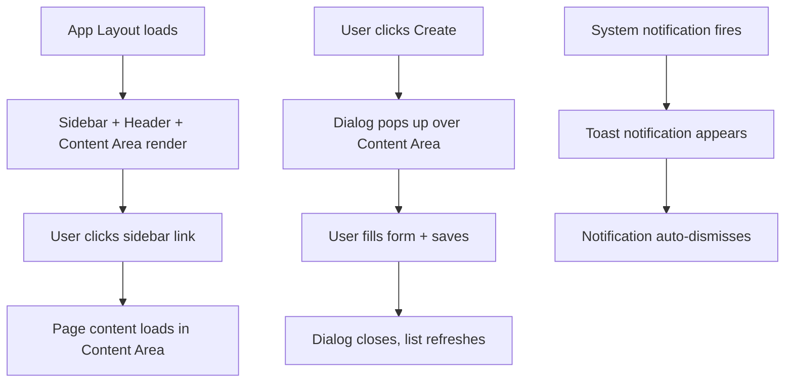
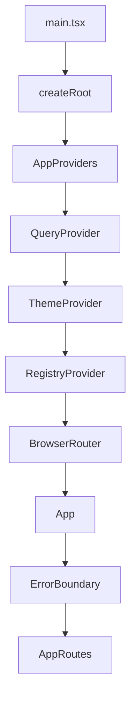

# Frontend Components & State

## Purpose
Shared UI components (layouts, dialogs, fields, tables, widgets), state management stores (notifications, UI, metadata), the metadata-driven registry system, and React Query configuration.

---

## Simple Instructions *(for non-developers)*

### What is this?
These are the reusable building blocks that make up the user interface. Everything you see on screen — the sidebar menu, the header bar, the dialog boxes that pop up, the tables that list data — is built from these shared components.

### What can you do here?
You don't use these directly, but every page you visit uses them:
- **Sidebar** — The navigation menu on the left side of the screen
- **Header** — The top bar with the user menu and notifications
- **Content Area** — The main area where page content appears
- **Dialogs** — Pop-up windows for creating or editing records
- **Notifications** — Alerts and messages that appear at the top of the screen

### How to use it

1. The **Sidebar** is always visible on the left — click any section to navigate.
2. The **Header** at the top shows your user name — click it to access profile, settings, and logout.
3. When you click **Create** or **Edit** on a list page, a **Dialog** pops up for you to fill in the form.
4. **Notifications** appear briefly at the top when something important happens (success, error, warnings).

### Diagram

### Common issues
| Problem | What to do |
|---------|-------------|
| Sidebar menu items are missing | You may not have permission to see certain sections. Or the page is a placeholder. |
| Dialog does not close after saving | Try clicking the Cancel button or the X in the corner. |
| Notifications appear too briefly | This is the default behavior. Important errors also appear on the page itself. |

---

## Layout Components

| Component | Description |
|-----------|-------------|
| `AppLayout` | Main authenticated layout: sidebar navigation + header + content area. Wrapped by `ProtectedRoute`. |
| `Sidebar` | Navigation menu with links to dashboard, admin sections, modules |
| `Header` | Top bar with user menu, notifications, context indicator |
| `ContentArea` | Main content wrapper for page components |
| `PageContainer` | Standard page container with consistent padding and spacing |

## Dialog Components

| Component | Description |
|-----------|-------------|
| `EntityFormDialog` | Generic create/edit dialog. Accepts `FieldDef[]` (name, label, type, options, required). Renders MUI TextField/Select/Checkbox based on field type. |
| `UserFormDialog` | Specialized user dialog: username, email, first/last name, password, roles, status. |

## UI Components

| Component | Description |
|-----------|-------------|
| `EmptyState` | Illustrated empty state message for tables |
| `ErrorState` | Error message with retry button |

## Stores & State Management

### Notification Store (`core/store/notifications/`)
- `notificationStore.ts` — Zustand store for app-wide notifications/snackbar messages
- `notificationTypes.ts` — Types for notification severity, actions

### UI Store (`core/store/ui/`)
- `uiStore.ts` — Zustand store for UI state (sidebar open, theme mode, loading flags)
- `uiTypes.ts` — UI state type definitions
- `uiActions.ts` — Standalone actions for external access
- `uiSelectors.ts` — Memoized selectors

### Metadata Store (`core/metadata/`)
- `metadataStore.ts` — Zustand store: keyed maps of `models`, `views`, `layouts`, `workflows`. Actions: `setMetadata()`, `registerModel()`, `registerView()`, `registerWorkflow()`, `clearMetadata()`
- `metadataTypes.ts` — TypeScript types for `ModelDefinition`, `ViewDefinition`, `WorkflowDefinition`, etc.
- `metadataActions.ts` / `metadataSelectors.ts` / `metadataCache.ts` — Utilities and caching layer
- `schema/` — Zod validation schemas for metadata definitions

## Registry System (`core/registry/`)

The registry pattern enables metadata-driven runtime rendering:

| Sub-registry | Purpose |
|--------------|---------|
| `field/` | Field type renderers (text, number, date, select, relation, etc.) |
| `layout/` | Layout renderers (form, table, grid, tabs) |
| `action/` | Action handlers (save, delete, navigate) |
| `view/` | View type renderers (list, form, kanban, calendar) |
| `workflow/` | Workflow state machine handlers |

Core files:
- `registry.ts` — Central `Registry` class
- `registry.provider.tsx` — React context provider that initializes all sub-registries
- `registry.types.ts` — Registry type definitions
- `index.ts` — Barrel export and initialization

## React Query Configuration (`core/query/`)
- `QueryProvider.tsx` — Wraps app with `QueryClientProvider`
- `queryClient.ts` — Configured `QueryClient` with retry/staletime defaults
- `queryKeys.ts` — Central query key constants
- `queryConfig.ts` — Additional query configuration

## App Entry Point

## Related Backend
- N/A (pure frontend module)
