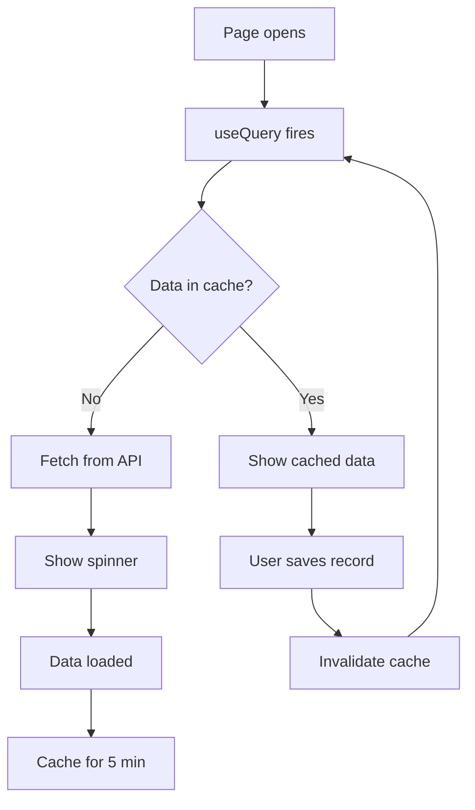

# Core — React Query

## Purpose
React Query (`@tanstack/react-query`) configuration — creates the global `QueryClient` with default options (retry, stale time, gc time) and provides hooks typed to the ERP API envelope.

---

## Simple Instructions *(for non-developers)*

### What is this?
This is the data fetching system. When you open a page, this module handles loading data from the server, showing loading spinners, caching results so pages load faster, and refreshing data when you save changes.

### What can you do here?
- As a regular user, you see its effects: fast page loads, automatic data refreshes after saving.
- Developers configure caching behavior here.

### How to use it
1. This works automatically in the background.
2. When you open a page, data loads and caches.
3. When you save a record, the cache clears and fresh data loads.
4. Retries happen automatically if a request fails.

### Diagram

### Common issues
| Problem | Solution |
|---------|----------|
| Page shows stale data | The cache may not have cleared. Try refreshing the page. |
| Data not refreshing after save | The mutation may not be invalidating the correct query key. |

---

## Key Classes *(developers)*

| Class/File | Role |
|-----------|------|
| `core/query/queryClient.ts` | Global `QueryClient` instance with default options |
| `core/query/hooks.ts` | Shared query hooks and mutation helpers |

## Dependencies
- `@tanstack/react-query`
- `core/api/client.ts` — API client for data fetching

## Related Backend
- N/A — Pure frontend library configuration
