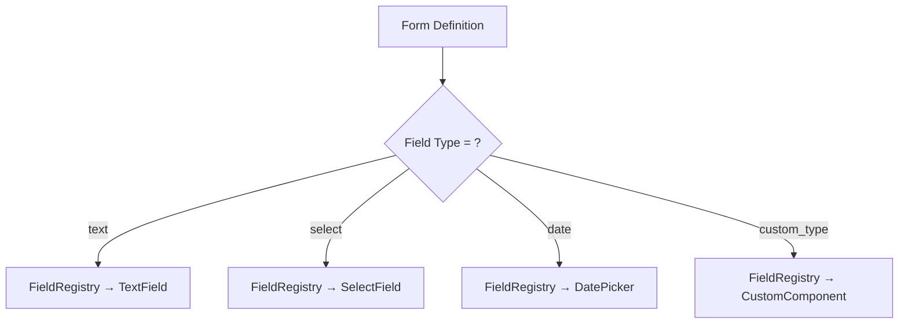

# Core Registry

## Purpose
Extensibility registry system — allows runtime component registration for fields, layouts, actions, views, and workflows. The engine uses these registries to look up the right renderer for each metadata definition.

---

## Simple Instructions *(for non-developers)*

### What is this?
This is a plugin system for developers. When a new type of form field or action button is needed, developers register it here, and the system automatically knows how to render it.

### What can you do here?
- As a regular user, you do not interact with this directly.
- Developers use this to extend the system with custom components.

### How to use it
1. This system works automatically — when a form definition says "field type = text", the registry finds the TextField renderer.
2. Developers can add new renderers by calling register functions.

### Diagram

### Common issues
| Problem | Solution |
|---------|----------|
| Field renders as a blank area | The field type is not registered in the FieldRegistry. |

---

## Key Classes *(developers)*

| Class/File | Role |
|-----------|------|
| `core/registry/field/index.ts` | Field component registry — maps field types to React components |
| `core/registry/layout/index.ts` | Layout renderer registry |
| `core/registry/action/index.ts` | Action handler registry |
| `core/registry/view/index.ts` | View renderer registry |
| `core/registry/workflow/index.ts` | Workflow step renderer registry |
| `core/metadata/schema/registry/` | Zod schemas for registry entries |

## Dependencies
- `core/metadata/schema/` — Zod schemas for validation
- React component tree

## Related Backend
- N/A — Pure frontend architecture
