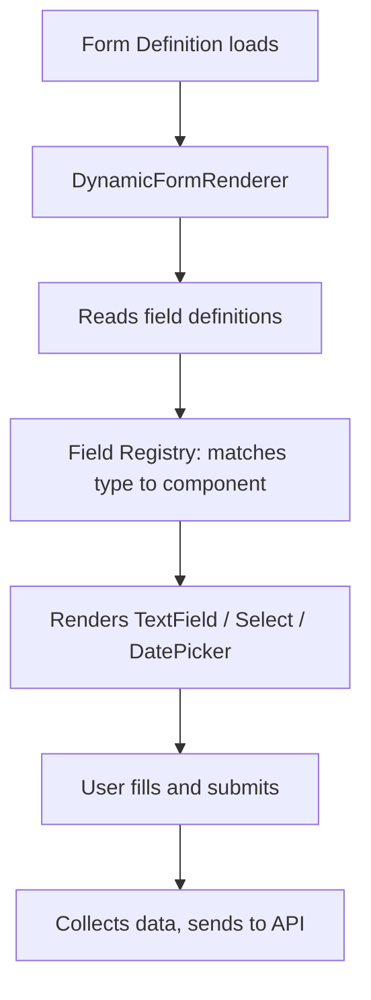

# Engine — Forms, Grids, Layouts, Actions

## Purpose
The rendering engine that takes metadata definitions and turns them into runtime UI components. Contains the `DynamicFormRenderer`, `FormFieldRenderer`, grid configurations, layout renderers, action dispatchers, and workflow renderers.

---

## Simple Instructions *(for non-developers)*

### What is this?
This is the engine that draws screens automatically. When the system receives a form definition (the blueprint), this engine reads it and creates the actual form fields, tables, and buttons you see on the screen.

### What can you do here?
- As a regular user, you interact with the output of this engine every time you fill out a form or view a table.
- You do not interact with the engine directly.

### How to use it
1. This engine works automatically whenever you open a form or list view.
2. It reads the form definition from the database.
3. It renders the right fields (text boxes, dropdowns, dates, etc.) based on the definition.
4. When you save, it collects the data and sends it back.

### Diagram

### Common issues
| Problem | Solution |
|---------|----------|
| A field shows as "unknown type" | The field type in the definition may not have a registered renderer. |
| Form layout looks wrong | The layout configuration may need adjustment. |

---

## Key Classes *(developers)*

| Class/File | Role |
|-----------|------|
| `engine/forms/DynamicFormRenderer.tsx` | Top-level form renderer — accepts form definition + data, orchestrates rendering |
| `engine/forms/FormFieldRenderer.tsx` | Field-level renderer — uses FieldRegistry to select the right component |
| `engine/fields/` | Individual field component registrations |
| `engine/layouts/` | Layout renderers (single-column, tabs, sections) |
| `engine/actions/` | Action dispatcher — handles button clicks, form submissions |
| `engine/grids/` | AG Grid configuration helpers for list views |
| `engine/workflows/` | Workflow step renderers |

## Dependencies
- `core/registry/field/` — Field component registry
- `core/registry/layout/` — Layout component registry
- `core/registry/action/` — Action handler registry
- `core/registry/view/` — View renderer registry
- `core/metadata/schema/` — Zod validation schemas
- `ag-grid-enterprise` — Grid rendering
- `@mui/material` — UI components

## Related Backend
- `core/runtime/` — Runtime metadata API provides form definitions
- `core/metadata/` — Form designer creates definitions consumed by this engine
