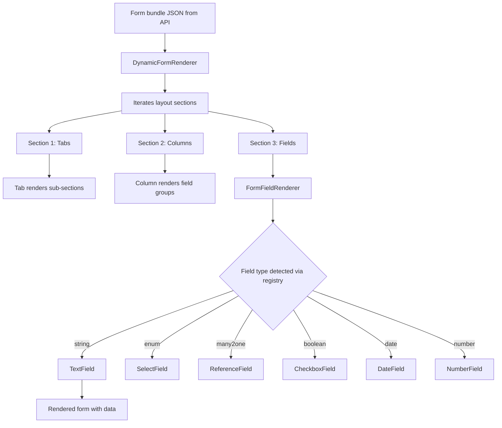

# Engine Form Renderer

## Purpose
The metadata-driven form rendering engine. Takes a form definition bundle (JSON from the API) and dynamically renders the form with correct fields, layout sections, rules, validations, and sub-forms. Uses a component registry pattern — field types are resolved at runtime.

---

## Simple Instructions *(for non-developers)*

### What is this?
This is the engine that draws forms on the screen. When you open any form in the system, this engine reads the form configuration (which fields to show, in what order, what type each field is) and builds the form automatically. It's like a smart blueprint reader that turns a set of instructions into a real, working form.

### What can you do here?
This engine is used by every dynamic form in the system:
- It reads the form definition sent by the backend
- It draws text fields, dropdowns, checkboxes, date pickers, and more
- It arranges them into tabs, columns, and sections
- It applies rules (show/hide fields, require fields)
- It runs validations when you try to save
- It shows sub-forms as interactive tabs at the bottom

### How to use it
You never interact with the engine directly — every form page uses it automatically.
1. Open any dynamic form (e.g., Create Product, Edit Order).
2. The engine reads the form bundle and renders the form.
3. Fields appear in sections with labels and input controls.
4. When you type, rules may show/hide other fields automatically.
5. When you click Save, validations run before the data is sent.

### Diagram

### Common issues
| Problem | Solution |
|---------|----------|
| A field shows "Unknown field type" | The field's type is not registered in the field registry. A developer must add a component for this type. |
| Form layout looks wrong | The layout sections may be misconfigured in the metadata. Check `sys_form_layout_sections` for correct section types. |
| Sub-form tab is empty | The sub-form may have no related records, or the relation configuration is incorrect. |

---

## Key Files *(developers)*

| File | Role |
|------|------|
| `engine/forms/DynamicFormRenderer.tsx` | Top-level renderer — reads form bundle, iterates layout sections, dispatches to section renderers |
| `engine/forms/FormFieldRenderer.tsx` | Field-level renderer — looks up field type in the registry and renders the matching component |
| `core/registry/field/` | Field component registry — maps type strings (string, number, date, enum, many2one, boolean) to React components |
| `core/registry/layout/` | Layout component registry — maps section types (tabs, columns, section) to layout components |
| `components/fields/` | Individual field components (TextField, SelectField, DateField, CheckboxField, NumberField, ReferenceField) |
| `components/layouts/` | Layout components (TabSection, ColumnSection, FieldGroup) |

---

## Dependencies
- `useForm()` hook — provides form bundle data, record data, and save/update functions
- `RegistryProvider` — makes field/layout registries available via React context
- `FormFieldRenderer` — resolves field types dynamically from the registry
- MUI 5 components — TextField, Select, Checkbox, DatePicker for actual UI rendering

---

## Related Backend
- `core-metadata-runtime.md` — Form bundle API that provides the JSON consumed by this renderer
