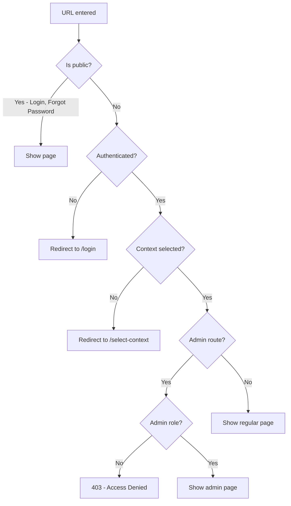

# Router & Guards

## Purpose
React Router v6 route definitions and guard components — defines the complete route tree for the application and provides guard wrappers for authentication (GuestRoute, AuthGuard), admin role (AdminRoute), and context selection (ContextGuard, ProtectedRoute).

---

## Simple Instructions *(for non-developers)*

### What is this?
This defines every page in the application and controls who can see what. When you type a URL or click a link, this module decides which page to show and checks that you have permission to view it.

### What can you do here?
- As a regular user, you navigate through pages automatically.
- If you are not logged in, you are sent to the **Login** page.
- If you try to go to an admin page without admin rights, access is denied.

### How to use it
1. This works automatically — just click links or type URLs.
2. The guards check your authentication and permissions before showing any page.

### Diagram

### Common issues
| Problem | Solution |
|---------|----------|
| Redirected to login in a loop | Clear your browser cache and localStorage, then log in again. |
| "Access denied" on admin page | Your role does not have admin privileges. Contact your admin. |
| Page not found | The URL may be incorrect. Check the address or navigate from the menu. |

---

## Key Classes *(developers)*

| Class/File | Role |
|-----------|------|
| `AppRoutes.tsx` | Complete route tree with nested `<Route>` definitions |
| `guards/GuestRoute.tsx` | Shows children only if user is NOT authenticated; redirects to `/app/dashboard` if already logged in |
| `guards/AuthGuard.tsx` | Shows children only if user IS authenticated; redirects to `/login` if not |
| `guards/ProtectedRoute.tsx` | Wraps all `/app/*` routes — checks auth + renders `AppLayout` sidebar/header |
| `guards/ContextGuard.tsx` | Requires a context (tenant/org/branch) to be selected; redirects to `/select-context` if missing |
| `guards/AdminRoute.tsx` | Checks for admin role; shows children or "Access Denied" fallback |

## Route Tree

| Path | Guard | Component |
|------|-------|-----------|
| `/login` | GuestRoute | `LoginPage` |
| `/forgot-password` | GuestRoute | `ForgotPasswordPage` |
| `/reset-password` | GuestRoute | `ResetPasswordPage` |
| `/select-context` | AuthGuard | `ContextSelectPage` |
| `/app/*` | ProtectedRoute → ContextGuard | App layout + children |
| `/app/dashboard` | ContextGuard | `DashboardPage` |
| `/app/profile` | ContextGuard | `ProfilePage` |
| `/app/preferences` | ContextGuard | `PreferencesPage` |
| `/app/admin/*` | AdminRoute | Admin pages |
| `/app/window/:windowName` | ContextGuard | `WindowPage` |
| `/app/runtime` | ContextGuard | `RuntimePage` |

## Dependencies
- `react-router-dom` v6
- `core/auth/authStore.ts` — auth state for guards
- Core layout components

## Related Backend
- N/A — Pure frontend routing
