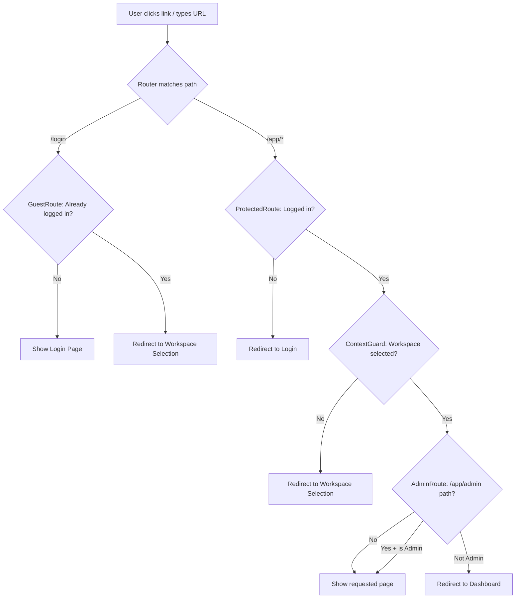
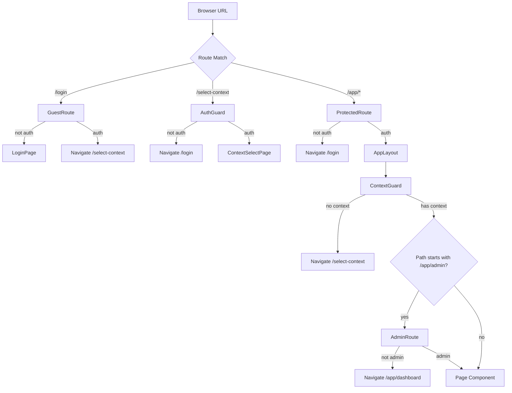

# Frontend Router & Guards

## Purpose
Defines all application routes using React Router v6 with layered guard components for authentication, authorization, context selection, and admin role checking.

---

## Simple Instructions *(for non-developers)*

### What is this?
This is the navigation system of the ERP app. It decides which page to show based on the URL you visit and checks that you are allowed to see it. Think of it as a security checkpoint at every door in the building.

### What can you do here?
You don't interact with this directly — it works in the background every time you navigate:
- When you type a URL or click a link, it routes you to the correct page.
- It checks that you are logged in before showing protected pages.
- It checks that you have the right role (e.g., admin) before showing admin pages.
- If you try to go somewhere you shouldn't, it redirects you to the right place.

### How to use it

1. **Click a link** in the sidebar — the router takes you to the correct page.
2. If you are **not logged in**, you will be sent to the **Login** page automatically.
3. If you try to access an **admin page** without admin rights, you will be redirected to the **Dashboard**.
4. If your **workspace context** is not set, you will be sent to the **Workspace Selection** page.

### Diagram



### Common issues
| Problem | What to do |
|---------|-------------|
| Clicking a link does nothing | Check the URL in your browser. It may be a broken link. |
| You keep being sent to the login page | Your session expired. Log in again. |
| Admin pages show "Access Denied" | Your account does not have an admin role. Contact your system administrator. |
| Stuck on Workspace Selection even after choosing | Try refreshing the page. If it persists, contact support. |

---

## Route Structure

```
/                          → Navigate /app/dashboard
/login                     → GuestRoute → LoginPage
/forgot-password           → GuestRoute → ForgotPasswordPage
/reset-password            → GuestRoute → ResetPasswordPage
/select-context            → AuthGuard → ContextSelectPage
/app                       → ProtectedRoute (wraps AppLayout)
  /app                     → Navigate /app/dashboard
  /app/dashboard           → DashboardPage
  /app/profile             → ProfilePage
  /app/preferences         → PreferencesPage
  /app/change-password     → ChangePasswordPage
  /app/sessions            → SessionsPage
  /app/admin               → AdminRoute (sys_admin | tnt_admin)
    /app/admin              → AdminDashboardPage
    /app/admin/tenants      → TenantsAdminPage
    /app/admin/organizations → OrganizationsAdminPage
    /app/admin/companies    → CompaniesAdminPage
    /app/admin/branches     → BranchesAdminPage
    /app/admin/departments  → DepartmentsAdminPage
    /app/admin/users        → UsersAdminPage
    /app/admin/roles        → RolesAdminPage
    /app/admin/permissions  → PermissionsAdminPage
    /app/admin/sessions     → SessionsAdminPage
    /app/admin/audit        → AuditPage
    /app/admin/tables       → TableListPage
    /app/admin/tables/create → CreateTablePage
    /app/admin/tables/:id    → TableDetailPage
    /app/admin/forms         → FormListPage
    /app/admin/forms/:id     → FormDesignerPage
  /app/products             → Placeholder
  /app/orders               → Placeholder
  /app/users                → Placeholder
  /app/settings             → Placeholder
  /app/runtime              → RuntimePage
  /app/window/:windowName   → WindowPage
*                           → Navigate /app/dashboard

### New Window Routes

| Route | Component | Description |
|-------|-----------|-------------|
| `/app/window/:windowName` | `WindowPage` | Metadata-driven window page — loads window definition + record list for the given window name |
| `/runtime/:formCode` | `Navigate` | Legacy redirect — `/runtime/sales_order` redirects to `/window/sales_order` |

### Route Table Update

The route table now includes two runtime pages:
- `WindowPage` at `/app/window/:windowName` — the primary data management screen for PRD-004 windows
- `RuntimePage` at `/app/runtime` — the legacy PRD-001 metadata-driven form renderer
```

## Guard Components

| Guard | Role | Checks |
|-------|------|--------|
| `AuthGuard` | Blocks unauthenticated access | Waits for Zustand hydration, then checks `isAuthenticated`. Redirects to `/login` if false. |
| `GuestRoute` | Blocks authenticated users from guest pages | If `isAuthenticated`, redirects to `/select-context`. |
| `ProtectedRoute` | Authenticated layout wrapper | Same hydration check; renders `AppLayout` with `<Outlet>` for child routes. Redirects to `/login` if not authenticated. |
| `ContextGuard` | Ensures context is selected | Calls `GET /context/current` and `GET /context/options`. Redirects to `/select-context` if no tenant, org, company, branch, or role is set. |
| `AdminRoute` | Restricts to admin roles | Checks `user.roles` includes `sys_admin` or `tnt_admin`. Redirects to `/app/dashboard` if not. |

## Guard Composition Order



## Auth Guard Hydration Handling

Both `AuthGuard` and `ProtectedRoute` handle Zustand persistence hydration:
1. Check `useAuthStore.persist.hasHydrated()` on mount
2. If not hydrated, show `<CircularProgress />` spinner and subscribe to `onFinishHydration`
3. 2-second timeout fallback to prevent infinite spinner
4. Once hydrated, evaluate auth state and either render children or redirect

## Key Files

| File | Role |
|------|------|
| `routes/AppRoutes.tsx` | All route definitions with guards |
| `routes/RouteLayout.tsx` | Simple layout wrapper (legacy/minimal) |
| `core/router/guards/AuthGuard.tsx` | Auth check for standalone pages |
| `core/router/guards/ProtectedRoute.tsx` | Auth + AppLayout wrapper |
| `core/router/guards/ContextGuard.tsx` | Context check + redirect |
| `core/router/guards/GuestRoute.tsx` | Blocks authenticated users |
| `core/router/guards/AdminRoute.tsx` | Role-based admin gate |

## Related Backend
- `backend-auth` — AuthController `/auth/me` validates token validity
- `backend-context` — ContextController `/context/current` and `/context/options` power the ContextGuard
- `backend-identity-admin` — all admin page endpoints
