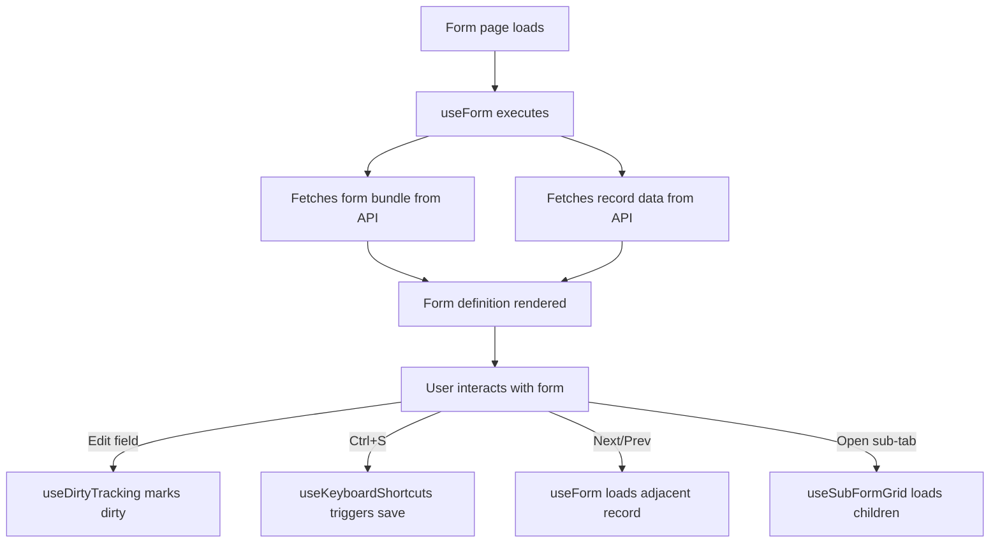

# Hooks Runtime

## Purpose
Custom React hooks that abstract the runtime form and data-fetching logic. Implement the two-request pattern (definition cached + data fresh), manage form state, dirty tracking, record navigation, keyboard shortcuts, and sub-form grids.

---

## Simple Instructions *(for non-developers)*

### What is this?
These are behind-the-scenes helpers that make dynamic forms work smoothly. They handle tasks like fetching form data when you open a page, keeping track of unsaved changes, and loading the next/previous record when you click the navigation buttons. You don't see them — they just make the forms work.

### What can you do here?
These hooks are used by the form pages automatically. They handle:
- Loading form definitions and record data when you open a form
- Tracking whether you have unsaved changes
- Loading the next or previous record
- Loading sub-form grids (like order lines inside an order)
- Responding to keyboard shortcuts (Ctrl+S to save, Escape to cancel)

### How to use it
You don't use these directly — they are built into every dynamic form page. When you:
1. **Open a form** — `useForm` loads the form definition bundle + record data
2. **Change a field** — `useDirtyTracking` marks the form as dirty
3. **Press Ctrl+S** — `useKeyboardShortcuts` triggers save
4. **Open a sub-form tab** — `useSubFormGrid` loads the related records
5. **Navigate records** — `useForm` fetches the next/previous record data

### Diagram

### Common issues
| Problem | Solution |
|---------|----------|
| Form shows "Loading..." forever | The backend may be down or the form bundle API is failing. Check the network tab. |
| Changes are lost when navigating | The .save() function checks dirty state. If navigating away with unsaved changes, a confirmation dialog may appear. |
| Keyboard shortcuts don't work | Make sure the form has focus (click anywhere on the form first). |

---

## Key Files *(developers)*

| File | Role |
|------|------|
| `useForm.ts` | Core hook — fetches form bundle + record data, manages form state, save/update, record navigation, dirty tracking |
| `useForm.types.ts` | TypeScript types for form state, record data, save payload, validation results |
| `useRecordList.ts` | Fetches paginated record lists with sorting and search — powers list/table views |
| `useSubFormGrid.ts` | Fetches child records for sub-form tabs — supports AG Grid inline editing |
| `useAccessibleForms.ts` | Fetches the list of forms the current user has access to — powers search and role-based menus |
| `useKeyboardShortcuts.ts` | Registers keyboard event listeners (Ctrl+S, Alt+arrows, F5, Escape) |
| `useDirtyTracking.ts` | Tracks whether the form has unsaved changes since last save |

---

## Dependencies
- `apiClient.ts` — Axios HTTP client with JWT interceptor
- `React Query` — query/mutation hooks for server state caching
- `runtimeApi.ts` — API functions: `fetchFormBundle()`, `fetchRecord()`, `saveRecord()`, `deleteRecord()`
- `authStore.ts` — user/tenant context for API calls

---

## Related Backend
- `core-metadata-runtime.md` — Runtime form API endpoints
- `backend-auth.md` — User authentication and context
