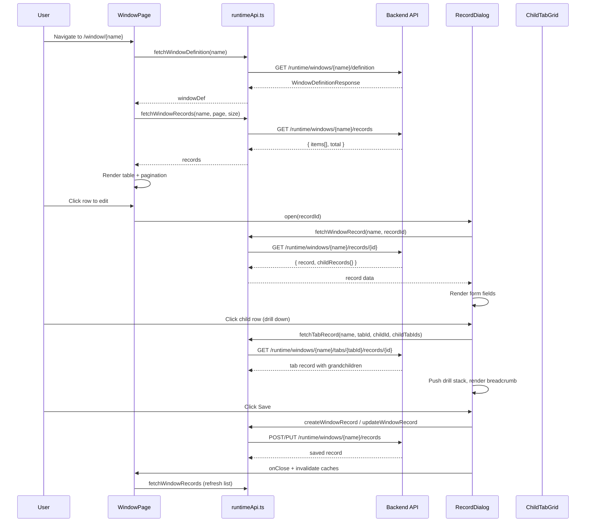

# Frontend Runtime Window Page & Components

## Purpose
The new Window-based runtime UI. The `WindowPage` renders a dynamic list view + record detail dialog driven by the window metadata from the backend. Includes drill-down navigation through tab hierarchies, inline-editable child grids, breadcrumb navigation, lookup dropdowns, and menu integration.

---

## Simple Instructions *(for non-developers)*

### What is this?
This is the main data management screen you see when you click on a menu item in the sidebar. It shows a list of records in a table, and clicking a record opens a dialog where you can view or edit its details. If the window has sub-sections (tabs), they appear as expandable panels for child records. You can click into a child record to drill deeper.

### What can you do here?
- **View records** in a paginated table with sortable columns
- **Create new records** using the "New" button
- **Edit existing records** by clicking on a row
- **Delete records** using the Delete button
- **Navigate child records** — related items appear as expandable accordion panels
- **Drill down** into child records to view/edit their details
- **Look up values** — dropdown fields auto-populate from related tables
- **Refresh** the view with the Refresh button

### How to use it
1. Click any menu item in the sidebar — a **Window Page** opens at `/window/{name}`.
2. The page shows a table with existing records. Use **New** to create a record or click a row to edit.
3. In the record dialog, fill in the fields. Dropdowns (many2one fields) show options from related tables.
4. If the record has child records (like Order Lines in an Order), they appear as expandable panels at the bottom.
5. Click on a child record row to **drill down** — a breadcrumb trail appears showing your navigation path.
6. Click **Save** to save your changes. Click **Cancel** to discard.

### Diagram

```mermaid
graph TD
  A[User clicks menu item] --> B[WindowPage loads at /window/{name}]
  B --> C[Fetches window definition + records]
  C --> D[Renders record list table]
  D --> E{User action}
  E -->|Click New| F[Opens RecordDialog]
  E -->|Click row| F
  F --> G[Form fields with lookup dropdowns]
  G --> H{Has child tabs?}
  H -->|Yes| I[Expandable accordion panels]
  I --> J[User clicks child row → Drill Down]
  J --> K[Breadcrumb updates + form changes]
  K --> J
  H -->|No| L[Click Save]
  F --> L
  L --> M[Record saved, list refreshes]
  
  D --> N[User clicks Delete]
  N --> O[Confirm → Record soft-deleted]
```

### Common issues
| Problem | Solution |
|---------|----------|
| Record list is empty | Try clicking **Refresh**. If still empty, no records have been created yet. |
| Dropdown field shows no options | The related table may not have any records, or the lookup API failed. |
| Child tab accordion is blank | Click the accordion header to expand it. If still blank, the record has no children. |
| Cannot edit a field | The field may be set to read-only (`is_readonly`) in the window field configuration. |
| Drill-down breadcrumb is confusing | Click any breadcrumb part to go back to that level. The breadcrumb shows `TabName (DisplayValue)`. |

---

## Key Files *(developers)*

### Main Page

| File | Role |
|------|------|
| `routes/window/WindowPage.tsx` | Main window page — renders record list table with pagination, tabs for top-level tab switching, New/Edit/Delete actions. Contains `RecordDialog` sub-component for create/edit with drill-down breadcrumb navigation, and `ChildTabGrid` for inline-editable child record grids. |

### API Client

| File | Role |
|------|------|
| `core/runtime/api/runtimeApi.ts` | API functions: `fetchWindowDefinition()` → GET definition, `fetchWindowRecords()` → GET paginated list, `fetchWindowRecord()` → GET single with children, `fetchTabRecord()` → GET drill-down tab record, `createWindowRecord()` → POST, `updateWindowRecord()` → PUT, `deleteWindowRecord()` → DELETE, `fetchLookupRecords()` → GET lookup data |

### Runtime Components

| File | Role |
|------|------|
| `components/MenuNavigation.tsx` | Sidebar menu component — iterates menu items from `useMenuItems`, renders collapsible groups and window links |
| `components/FormBreadcrumb.tsx` | Breadcrumb trail showing current navigation path through window → tabs |
| `components/FormSearchBar.tsx` | Search bar for filtering record lists (Ctrl+K / global search) |
| `components/FormToolbar.tsx` | Toolbar with New/Save/Delete/Refresh/Prev/Next buttons |
| `components/InlineEditableGrid.tsx` | Excel-like inline editable grid for child tab records (Quick Update toggle) |
| `components/RecordNavigator.tsx` | Prev/Next record navigation within a form |
| `components/SubFormTabPanel.tsx` | Tab panel for sub-form content |
| `components/SubFormTabBadge.tsx` | Badge showing child record count |

### Hooks

| File | Role |
|------|------|
| `hooks/useMenuItems.ts` | Fetches accessible windows from `GET /runtime/windows/accessible` and menu tree from `GET /runtime/menus`, builds sidebar navigation structure |
| `hooks/useRecordList.ts` | Paginated record list fetching with sorting and search filtering |
| `hooks/useSubFormGrid.ts` | Fetches child records for tab grids, supports inline editing |
| `hooks/useAccessibleForms.ts` | Fetches list of forms/windows the current user can access (for search) |
| `hooks/useDirtyTracking.ts` | Tracks unsaved form changes |
| `hooks/useKeyboardShortcuts.ts` | Global keyboard shortcuts (Ctrl+S save, Escape cancel) |

---

## WindowPage Architecture



---

## Dependencies
- React Router v6 — `useParams` for `windowName` route parameter
- React Query — `useQuery`, `useMutation`, `useQueries`, `useQueryClient`
- MUI 5 — `Accordion`, `Dialog`, `Table`, `TextField`, `Select`, `Tabs`, `Button`, etc.
- `apiClient.ts` — Axios HTTP client with JWT interceptor

---

## Related Backend
- `backend-metadata-window.md` — Window definition API, Window data CRUD API, menu and access control

---

## Related Module Docs
- `hooks-runtime.md` — Runtime hooks used by WindowPage (useMenuItems, useRecordList, useSubFormGrid)
- `frontend-core-router.md` — Route definitions including `/window/:windowName`
