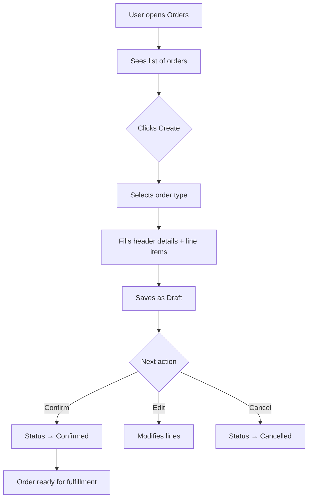

# Service Order

## Purpose
Manages the full order lifecycle: sales orders, purchase orders, and order lines. Unified order header (`orders` table) with order type differentiation (SALES / PURCHASE). Handles order status flow from DRAFT through CONFIRMED to COMPLETED.

---

## Simple Instructions *(for non-developers)*

### What is this?
This is the order management system. You can create sales orders (selling to customers) and purchase orders (buying from suppliers). Each order has a unique number, a party (customer or supplier), a date, and line items with quantities and prices.

### What can you do here?
- Create sales orders for customers
- Create purchase orders for suppliers
- Add multiple line items to each order
- Track order status (Draft, Confirmed, Completed, Cancelled)
- View the total amount for each order

### How to use it
1. Go to **Orders** in the sidebar menu.
2. Click **Create Order**.
3. Select the **Order Type** (Sales or Purchase).
4. Choose the **Customer** or **Supplier** (business partner).
5. Add line items: select a product, enter quantity and price.
6. Click **Save** — the order is created in **Draft** status.
7. To finalize, click **Confirm** to move the order to Confirmed status.

### Diagram

### Common issues
| Problem | Solution |
|---------|----------|
| Cannot create order — "Party not found" | The customer or supplier must exist in Business Partners first. |
| Order total is zero | Make sure line items have both quantity and price entered. |
| Cannot edit a Confirmed order | Confirmed orders are locked. Create a cancellation and a new order instead. |

---

## Key Classes *(developers)*

| Class | Role |
|-------|------|
| `Order` | JPA entity mapped to `@Table(name = "orders")` — unified header for all order types |
| `OrderLine` | JPA entity mapped to `@Table(name = "order_lines")` — line items with product, qty, price |
| `OrderController` | REST CRUD: GET/POST/PUT/DELETE `/api/v1/orders` + status transitions |
| `OrderService` | Business logic: create order, add lines, calculate totals, status transitions |
| `SalesOrderController` | Sales-specific order endpoints (quoting, sales workflows) |
| `PurchaseOrderController` | Purchase-specific order endpoints (procurement, receiving) |

---

## API Endpoints

| Method | Path | Handler | Auth |
|--------|------|---------|------|
| GET | `/api/v1/orders` | `OrderController.list()` | JWT |
| GET | `/api/v1/orders/{id}` | `OrderController.get()` | JWT |
| POST | `/api/v1/orders` | `OrderController.create()` | JWT |
| PUT | `/api/v1/orders/{id}` | `OrderController.update()` | JWT |
| DELETE | `/api/v1/orders/{id}` | `OrderController.delete()` | JWT |
| PUT | `/api/v1/orders/{id}/confirm` | `OrderController.confirm()` | JWT |
| PUT | `/api/v1/orders/{id}/cancel` | `OrderController.cancel()` | JWT |

---

## Dependencies
- `BaseService<T>` — generic CRUD with lifecycle hooks
- `BaseEntity` — UUID id, tenant_id, soft-delete, timestamps
- `OrderRepository`, `OrderLineRepository`
- `ProductRepository` — product lookup for line items
- `BusinessPartnerRepository` — customer/supplier lookup

---

## Related Frontend
- Business modules may include order list/detail views
- Runtime form renderer displays dynamic order forms (V22 migration registers purchase/sales order forms)
