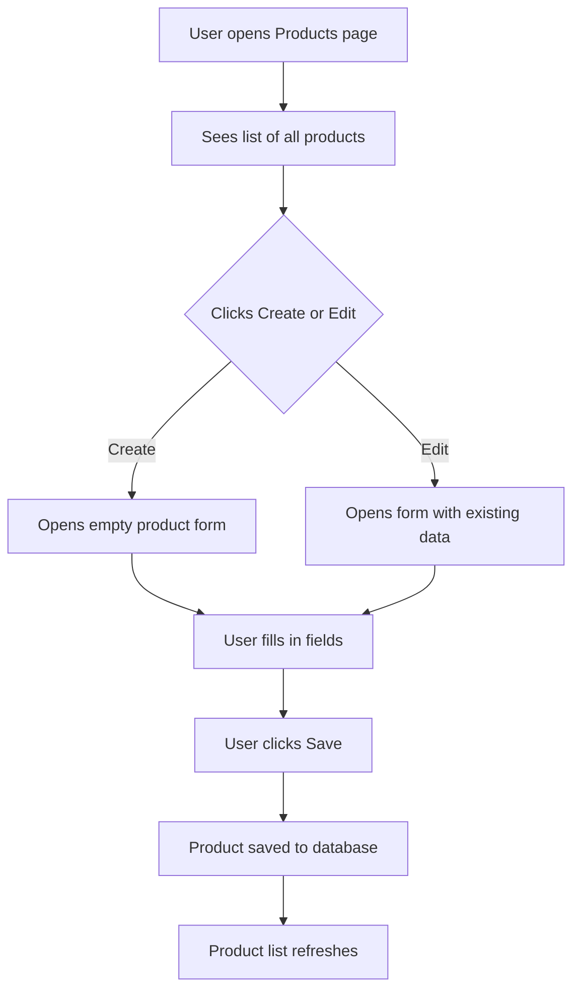

# Service Product

## Purpose
Business module for product catalog management. Manages product definitions, categories, SKU/barcode tracking, UOM, pricing, and product type classification (stockable, service, etc.).

---

## Simple Instructions *(for non-developers)*

### What is this?
This is the product catalog. Every item your company buys, sells, or stocks is defined here. Products can be physical goods (like "Laptop" or "Mouse") or services (like "Consulting"). Each product has a code, name, description, SKU, barcode, and unit of measure.

### What can you do here?
- Create new products with codes, names, and descriptions
- Organize products into categories
- Set pricing information (cost price, sale price)
- Track by SKU, barcode, or product code
- Classify products as stockable, sold, or purchased

### How to use it
1. Go to **Products** in the sidebar menu.
2. Click **Create Product** to add a new item.
3. Fill in the required fields: **Code**, **Name**, and **Product Type**.
4. Optionally add a **Category**, **SKU**, **Barcode**, and **UOM**.
5. Click **Save** — the product appears in the catalog.

### Diagram

### Common issues
| Problem | Solution |
|---------|----------|
| "Product code already exists" | Each product code must be unique. Try a different code. |
| Cannot find a product in the list | Use the search bar or filter by category. |
| Dropdown field is empty | The referenced table may not have any records yet (e.g., no UOMs or categories created). |

---

## Key Classes *(developers)*

| Class | Role |
|-------|------|
| `ProductController` | REST CRUD endpoints: GET/POST/PUT/DELETE `/api/v1/products` |
| `ProductCategoryController` | REST CRUD endpoints: GET/POST/PUT/DELETE `/api/v1/product-categories` |
| `ProductService` | Business logic for product CRUD, unique code validation, category lookup |
| `ProductCategoryService` | Business logic for category CRUD, hierarchical category support |
| `Product` | JPA entity mapped to `@Table(name = "products")` — extends `BaseEntity` |
| `ProductCategory` | JPA entity mapped to `@Table(name = "product_categories")` |
| `ProductRepository` | Spring Data JPA repository with custom queries for code/SKU lookup |
| `ProductCategoryRepository` | Spring Data JPA repository for category queries |

---

## API Endpoints

| Method | Path | Handler | Auth |
|--------|------|---------|------|
| GET | `/api/v1/products` | `ProductController.list()` | JWT |
| GET | `/api/v1/products/{id}` | `ProductController.get()` | JWT |
| POST | `/api/v1/products` | `ProductController.create()` | JWT |
| PUT | `/api/v1/products/{id}` | `ProductController.update()` | JWT |
| DELETE | `/api/v1/products/{id}` | `ProductController.delete()` | JWT |
| GET | `/api/v1/product-categories` | `ProductCategoryController.list()` | JWT |
| POST | `/api/v1/product-categories` | `ProductCategoryController.create()` | JWT |
| PUT | `/api/v1/product-categories/{id}` | `ProductCategoryController.update()` | JWT |

---

## Dependencies
- `BaseService<T>` (common.base) — provides generic CRUD with lifecycle hooks
- `BaseEntity` (common.base) — UUID id, tenant_id, soft-delete, timestamps
- `ProductRepository` / `ProductCategoryRepository`
- Multi-tenancy via Hibernate `@Filter` on `tenant_id`

---

## Related Frontend
- Business modules may include product list/grid views
- Runtime form renderer can also display dynamic product forms registered via Flyway metadata (V19+)
