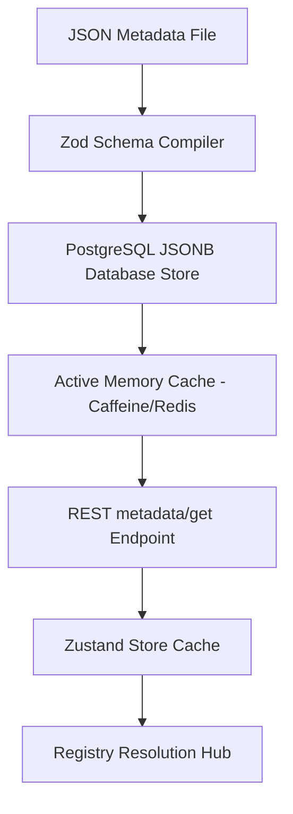
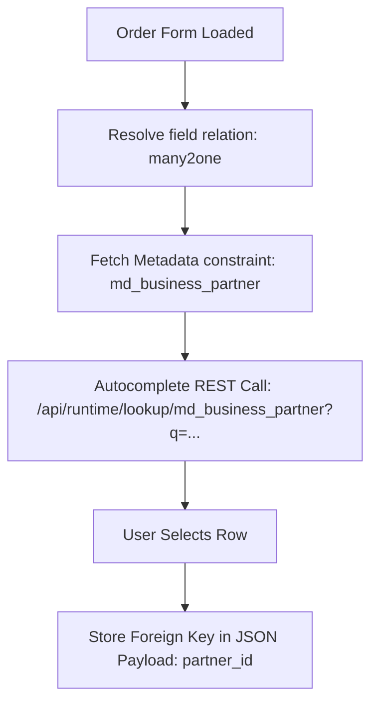
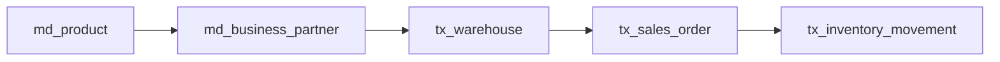

# Dynamic ERP Platform — Phase 0 Architecture Blueprint
### Stable Runtime Architecture & System Specification
**Status:** FROZEN  
**Author:** Principal ERP Platform Architect  
**Date:** May 2026

---

## Executive Summary

This document establishes the frozen architectural foundation and specifications for the **Dynamic ERP Platform**. Unlike standard CRUD-focused enterprise applications which rely on hardcoded pages, forms, and database schemas for every module, the Dynamic ERP Platform operates as a **metadata-driven runtime execution engine**.

The core philosophy of the system is the complete separation of **data structures/business rules (Metadata)** from the **rendering engine (Frontend)** and **execution pipeline (Backend)**. All forms, lists, workflows, validation rules, permissions, and database operations are resolved dynamically at runtime by parsing JSON-formatted schemas.

```
       ┌────────────────────────────────────────────────────────┐
       │                 METADATA DEFINITIONS                   │
       │    (JSON: Models, Views, Workflows, Permissions)       │
       └───────────────────────────┬────────────────────────────┘
                                   │
                  ┌────────────────┴────────────────┐
                  ▼                                 ▼
   ┌─────────────────────────────┐   ┌─────────────────────────────┐
   │       BACKEND RUNTIME       │   │      FRONTEND RENDERER      │
   │    - Dynamic Validation     │   │   - Component Registries    │
   │    - Workflow Execution     │   │   - Dynamic Form Assembly   │
   │    - Permission Enforcement │   │   - Action Execution Hub    │
   │    - JSONB Database Storage │   │   - Responsive Layouts      │
   └─────────────────────────────┘   └─────────────────────────────┘
```

---

## Table of Contents
1. [P0.1 — ERP Runtime Philosophy](#p01--erp-runtime-philosophy)
2. [P0.2 — Metadata Architecture & Storage](#p02--metadata-architecture--storage)
3. [P0.3 — Frontend Runtime Architecture](#p03--frontend-runtime-architecture)
4. [P0.4 — Backend Engine Architecture](#p04--backend-engine-architecture)
5. [P0.5 — API Contracts & Payload Standards](#p05--api-contracts--payload-standards)
6. [P0.6 — Naming Conventions & Standards](#p06--naming-conventions--standards)
7. [P0.7 — Relation Resolution & Loading Strategy](#p07--relation-resolution--loading-strategy)
8. [P0.8 — Workflow & Transition Engine](#p08--workflow--transition-engine)
9. [P0.9 — Security & Multi-Level Permission Engine](#p09--security--multi-level-permission-engine)
10. [P0.10 — Expression Engine (JSON Logic)](#p010--expression-engine-json-logic)
11. [P0.11 — ERP Module Evolution Roadmap](#p011--erp-module-evolution-roadmap)
12. [P0.12 — Extensible Plugin Architecture](#p012--extensible-plugin-architecture)
13. [P0.13 — Multi-Tenant Isolation Strategy](#p013--multi-tenant-isolation-strategy)
14. [P0.14 — Enterprise Audit & Traceability Strategy](#p014--enterprise-audit--traceability-strategy)
15. [P0.15 — Testing Strategy & Boundaries](#p015--testing-strategy--boundaries)

---

## P0.1 — ERP Runtime Philosophy

The core of the Dynamic ERP platform is defined by a strict separation of concerns where UI representations and application logic are completely generated from structural metadata.

### 1. Responsibility Matrix

| Responsibility | Backend (Runtime Execution Engine) | Frontend (Runtime UI Renderer) |
| :--- | :--- | :--- |
| **Data Integrity** | Enforces core schema constraints, handles data persistence. | Pre-validates data locally, renders errors inline. |
| **Logic Evaluation** | Executes calculations, database triggers, and permissions. | Evaluates UI states (visibility, read-only, layout). |
| **Workflow State** | Progresses state machines, evaluates database guards. | Renders actions, transition buttons, active states. |
| **Security** | Hard filtering, field stripping, tenant/row checks. | Dynamic field hiding, button disabling, menu visibility. |
| **Metadata Management** | Stores, updates, compiles and serves active metadata. | Caches, indexes, registries, and renders schemas. |

### 2. Architectural Principles
* **Declarative Over Imperative:** Code is only written for the core platform. All ERP features (fields, validation, workflow transitions, layouts) must be declared in JSON configuration files.
* **Database-First Schema Projection:** Database tables are dynamically managed or projected based on compiled model metadata. Hardcoding entities in Java is limited to core system metadata tables.
* **Statefulness on Backend, Statelessness on Frontend:** The frontend acts as a pure reactive representation of current state and metadata.

### 3. Anti-Patterns to Avoid
* **Screen-Specific Controllers:** Writing endpoints like `/api/sales-order/submit-button` is forbidden. Instead, use generic action runners `/api/runtime/action/execute` with structural payload constraints.
* **Component-Specific State Machines:** Frontend components should not decide if a field is hidden based on local logic variables like `if (status === 'draft' && userRole === 'admin')`. Instead, they must evaluate centralized expressions retrieved from view and layout metadata schemas.

---

## P0.2 — Metadata Architecture & Storage

Metadata acts as the single source of truth for the platform.



### 1. Schema Specifications
The following core metadata definitions reside inside JSON schemas:

* **Model Metadata:** Holds physical database mapping configurations, field types, default values, and relational links.
* **View Metadata:** Outlines list columns, form fields, filtering rules, search inputs, and dashboard widgets.
* **Layout Metadata:** Hierarchical trees defining CSS flex grids, section divisions, component groups, tab strips, and vertical steps.
* **Workflow Metadata:** Defines finite state machines, workflow actions, trigger guards, state rules, and automatic webhooks.
* **Permission Metadata:** Contains granular action-level access lists, field visibility flags, and multi-tenant overrides.

### 2. Database Storage Strategy
* Root metadata configurations are stored in PostgreSQL using relational tables supporting a `JSONB` column named `definition`.
* An active version table (`sys_metadata_version`) tracks historical modifications and allows rapid rollbacks.
* Indices are created directly on JSONB properties to support high-performance lookup of metadata attributes by code names (e.g., `model_name`, `view_type`).

### 3. Caching & Invalidation Cycle
* **Backend Caching:** Java utilizes a two-level Caffeine cache (L1 JVM memory) and Redis cache (L2 cross-instance distribution).
* **Frontend Cache:** Local React state utilizes a Zustand store with selective localStorage hydration for rapid application startup.
* **Invalidation:** Changing metadata broadcasts a message over Redis Pub/Sub, incrementing the global application metadata version number and triggering atomic client-side updates.

---

## P0.3 — Frontend Runtime Architecture

The frontend is constructed not as an collection of pages, but as a generic rendering engine that interprets metadata and maps structural fields to reusable component registries.

```
                  ┌───────────────────────────────┐
                  │      viewMetadata Loader      │
                  └───────────────┬───────────────┘
                                  ▼
                  ┌───────────────────────────────┐
                  │    Registry Resolution Hub    │
                  └──────┬─────────────────┬──────┘
                         │                 │
      ┌──────────────────▼──┐           ┌──▼──────────────────┐
      │   layoutRegistry    │           │    fieldRegistry    │
      │ (Tabs/Grids/Blocks) │           │ (TextBox/Dropdown)  │
      └──────────────────┬──┘           └──┬──────────────────┘
                         │                 │
                         └────────┬────────┘
                                  ▼
                  ┌───────────────────────────────┐
                  │     Dynamic Form Assembly     │
                  └───────────────────────────────┘
```

### 1. Unified Frontend Technology Stack
* **Core:** React 18+ (Functional components, Hooks).
* **UI/Design:** Material UI (MUI) v5 with responsive Inter type configurations.
* **State Management:** Zustand (reactive stores), TanStack React Query (server-state synchronization).
* **Grid Rendering:** AG Grid Enterprise (for performant dynamic tables, virtualization).
* **Validation:** Zod schemas compiled on-the-fly.

### 2. Registry Architecture
The engine uses key-based registries to inject custom or default implementations:

```typescript
// Core Field Registry Example
class FieldRegistry {
  private registry = new Map<string, React.ComponentType<any>>();

  register(type: string, component: React.ComponentType<any>) {
    this.registry.set(type, component);
  }

  get(type: string): React.ComponentType<any> {
    return this.registry.get(type) || DefaultTextField;
  }
}
export const fieldRegistry = new FieldRegistry();
```

* **layoutRegistry:** Resolves structural wrapper types like `TABS`, `SECTIONS`, `COLLAPSIBLES`, `CARDS`.
* **fieldRegistry:** Resolves controls like `many2one` (RelationSelector), `integer` (NumberField), `datetime` (DatePicker).
* **actionRegistry:** Maps operations (e.g., `EXECUTE_WORKFLOW`, `EXPORT_EXCEL`, `NAVIGATE`) to handlers.

---

## P0.4 — Backend Engine Architecture

The backend Spring Boot server acts as a stateless transactional execution processor.

### 1. Spring Boot Workspace Structure
```
backend/
├── src/main/java/com/erp/
│   ├── ErpApplication.java          # Spring Boot Launcher
│   ├── common/                      # Kernels and base frameworks
│   │   ├── base/                    # Abstract entities, CRUD services
│   │   ├── errors/                  # Global exceptions, status maps
│   │   └── expressions/             # JSON Logic evaluator implementation
│   ├── config/                      # Web, Security, Caching, and DB Config
│   ├── core/                        # System Runtime Engines
│   │   ├── metadata/                # Metadata API and DB repositories
│   │   ├── crud/                    # Dynamic CRUD Controllers and Service
│   │   ├── workflow/                # State machine execution pipeline
│   │   └── security/                # Granular permissions checkers
│   └── modules/                     # ERP Module Plug-in Implementations
│       ├── product/                 # Base Product specifications
│       ├── partner/                 # Customer/Vendor directory
│       └── order/                   # Transactions, Lines, Totals
```

<h3>2. Core Framework Layers</h3>
* **Dynamic CRUD Service:** Accepts runtime models, resolves standard database fields from dynamic metadata, maps queries using JPA Criteria API, and coordinates execution pipelines without requiring concrete Java Entity compiles for dynamic tables.
* **Shared Kernel Strategy:** Common functionality (e.g., Auditable context, global state machines) is packaged under the `common/` package and imported as baseline dependencies for all business modules.

---

## P0.5 — API Contracts & Payload Standards

All endpoints strictly follow standard formats to guarantee compatibility across diverse system components.

### 1. Standard Response Body Structures

#### A. Success JSON Structure
```json
{
  "success": true,
  "data": {
    "id": "so_10023",
    "name": "SO-2026-00041",
    "amount": 2500.00
  },
  "message": "Sales order retrieved successfully."
}
```

#### B. Error JSON Structure
```json
{
  "success": false,
  "errorCode": "VALIDATION_FAILED",
  "message": "One or more fields failed validation checks.",
  "details": [
    {
      "field": "quantity",
      "issue": "Quantity must be greater than zero."
    }
  ]
}
```

#### C. Paginated Response JSON Structure
```json
{
  "success": true,
  "data": {
    "items": [
      { "id": "p_001", "name": "Standard Sprocket" }
    ],
    "page": 1,
    "size": 20,
    "total": 142
  },
  "message": "Products page loaded."
}
```

### 2. Filtering, Sorting, and Sorting Operations
Filtering properties are passed as nested JSON structures or query operators to support advanced logical clauses:

```http
GET /api/runtime/crud/sales_order?page=1&size=20&sort=name,desc&filter={"and": [{"field": "status", "op": "eq", "value": "draft"}, {"field": "amount", "op": "gte", "value": 1000}]} HTTP/1.1
```

Supported Comparison Operators:
* `eq` (Equal), `ne` (Not Equal)
* `gt` (Greater than), `gte` (Greater/Equal)
* `lt` (Less than), `lte` (Less/Equal)
* `like` (String pattern matching)
* `in` (Array presence checks)

---

## P0.6 — Naming Conventions & Standards

Uniform conventions prevent schema mismatches and coordinate automated metadata lookup logic.

### 1. Case Conventions Matrix

| Target | Convention | Case Style | Example |
| :--- | :--- | :--- | :--- |
| **Database Tables** | Pluralized, snake_case | Lowercase | `sales_orders`, `order_lines` |
| **Database Columns** | Singular, snake_case | Lowercase | `customer_id`, `grand_total` |
| **Java Classes** | Singular, PascalCase | Camel | `SalesOrder`, `CustomerRepository` |
| **React Components** | Singular, PascalCase | Camel | `OrderFormRenderer`, `NumberField` |
| **API Endpoints** | Pluralized, kebab-case | Lowercase | `/api/v1/sales-orders`, `/api/metadata` |
| **Metadata Codes** | Singular, snake_case | Lowercase | `sales_order`, `payment_status` |
| **Variables/Props** | CamelCase | Mixed | `orderAmount`, `isReadOnly` |

### 2. Standard Metadata Prefixes
* Core system configurations: Prefix with `sys_` (e.g. `sys_user`, `sys_metadata`).
* Transaction tables: Prefix with `tx_` (e.g. `tx_inventory_movement`).
* Master data tables: Prefix with `md_` (e.g. `md_product`, `md_business_partner`).

---

## P0.7 — Relation Resolution & Loading Strategy

Dynamic relations are resolved by declaring foreign links inside the metadata definitions.



### 1. Supported Relationship Core Typologies
* **many2one (Foreign Key Lookup):** Maps directly to an ID reference of another model. Standard representation is the autocompleting dropdown or searching lookup modal.
* **one2many (Parent-Child Table):** Represents tabular line entries (e.g. Order Lines). Handled via nested inline editable sheets inside parent layouts.
* **many2many (Associative Link):** Relates multiple objects via a secondary bridge table. Handled via chip selectors or list pickers.

### 2. Relation Performance & Fetch Strategies
* **Autocomplete Lookup API:** Lookup queries must accept limit parameters (defaulting to 10 results) and utilize database text indices to ensure response times remain sub-50ms.
* **Transactional Save Pipelines:** Nested one2many documents (parent with many lines) must execute inside a single transactional context (`@Transactional(rollbackFor = Exception.class)`). If validation on any child line fails, the entire save session rolls back immediately.

---

## P0.8 — Workflow & Transition Engine

The platform manages document lifecycles dynamically using metadata state machines.

```
       ┌────────────────────────┐
       │         Draft          │
       └───────────┬────────────┘
                   │
                   │  Transition: COMPLETE
                   │  Guards: checkAmount(), checkLines()
                   ▼
       ┌────────────────────────┐
       │       Completed        │
       └───────────┬────────────┘
                   │
                   │  Transition: APPROVE
                   │  Guards: checkUserRole('manager')
                   ▼
       ┌────────────────────────┐
       │        Approved        │
       └────────────────────────┘
```

### 1. Workflow Schema Specification
Workflows define standard states, transitions, transition guards, and transition actions:

```json
{
  "workflowId": "sales_order_workflow",
  "model": "sales_order",
  "initialState": "draft",
  "states": ["draft", "completed", "approved", "cancelled"],
  "transitions": [
    {
      "name": "complete",
      "label": "Complete Order",
      "from": "draft",
      "to": "completed",
      "guards": [
        { "expression": { "gt": [{ "var": "grand_total" }, 0] } }
      ],
      "actions": [
        { "type": "SEND_NOTIFICATION", "template": "order_completed" }
      ]
    }
  ]
}
```

### 2. Transition Process Lifecycle
1. **Request:** Client requests a state change (`/api/runtime/workflow/transition`).
2. **Read:** Engine reads current row and validates transition path viability.
3. **Evaluate:** Evaluates security credentials and transition guards via the expressions library.
4. **Trigger:** Executes pre-transition workflow hooks and database modifications.
5. **Commit:** Persists new state string and writes record history tracking log.

---

## P0.9 — Security & Multi-Level Permission Engine

The platform protects data structures using a multi-layered security evaluation model.

```
                  ┌───────────────────────────────┐
                  │       System Access Check     │
                  └───────────────┬───────────────┘
                                  ▼
                  ┌───────────────────────────────┐
                  │       Module Level Auth       │
                  └───────────────┬───────────────┘
                                  ▼
                  ┌───────────────────────────────┐
                  │        View Access Check      │
                  └───────────────┬───────────────┘
                                  ▼
                  ┌───────────────────────────────┐
                  │       Row filtering check     │
                  └───────────────┬───────────────┘
                                  ▼
                  ┌───────────────────────────────┐
                  │      Field security strip     │
                  └───────────────────────────────┘
```

### 1. Security Hierarchy Details
* **Module Permissions:** Controls navigation layout access (e.g. Sales modules).
* **View Permissions:** Restricts screens (e.g., hiding critical accounting layout profiles).
* **Row-Level Permissions (Data Filters):** Dynamically Appends SQL limits depending on permissions (e.g., regional managers only accessing regional sales data).
* **Field Permissions:** Limits individual column read/write controls (e.g. hiding margins from junior salespeople).

### 2. Security Resolution Matrix
The runtime dynamically strips JSON serialization properties from both input payloads and outgoing REST structures by matching user active roles against the field's metadata configuration. If a field is declared `readonly` for a role, incoming updates containing that property are ignored on the backend.

---

## P0.10 — Expression Engine (JSON Logic)

To guarantee language-agnostic evaluations across both frontend (React) and backend (Spring Boot), the platform utilizes **JSON Logic** as its structural expression syntax.

### 1. Core Syntax Specifications
All UI toggles (read-only, visible, required) and business guards are declared in standard JSON format:

```json
{
  "visible": {
    "and": [
      { "==": [{ "var": "status" }, "draft"] },
      { "in": ["sales_manager", { "var": "user_roles" }] }
    ]
  }
}
```

### 2. Evaluation Partitioning
* **Frontend Execution:** Evaluates dynamically on keypress/render cycles to provide immediate UI feedback (disabling fields, showing sections).
* **Backend Execution:** Re-evaluates identical rules inside validation interceptors to secure database transactional operations.

---

## P0.11 — ERP Module Evolution Roadmap

This roadmap defines the implementation order designed to test the metadata runtime engine against realistic business scenarios.



### 1. Initial Target Business Modules

#### A. Product Master Data (`md_product`)
* **Role:** Establishes core system lookup targets.
* **Fields:** Code, Name, SKU, Category, Base Price, Cost, Status.

#### B. Business Partner (`md_business_partner`)
* **Role:** Validates customer/vendor relationships and nested contacts.
* **Fields:** Account Number, Name, Type (Customer/Vendor/Both), Credit Limit, Payment Terms.

#### C. Warehouse Configuration (`md_warehouse`)
* **Role:** Details physical storage structures.
* **Fields:** Name, Code, Location, Virtual Allocation Rules.

#### E. Sales Order Transaction (`tx_sales_order`)
* **Role:** Validates complex transactional parent-child lines, workflow state transitions, and price formulas.
* **Fields:** Order Number, Customer Link, Order Date, Grand Total, Status. Includes nested line list (product, qty, price, discount, line total).

#### F. Inventory Movement (`tx_inventory_movement`)
* **Role:** Stress tests backend transactional services and triggers stock allocation updates.
* **Fields:** Document Link, Source Warehouse, Target Warehouse, Move Date, State.

---

## P0.12 — Extensible Plugin Architecture

Plugins allow third-party developers to extend the ERP platform without modifying core source code.

### 1. Manifest Blueprint (`plugin.json`)
```json
{
  "pluginId": "crm_extension_pack",
  "name": "CRM Module Extension",
  "version": "1.0.0",
  "dependencies": ["base_erp_platform"],
  "models": [
    {
      "extend": "md_business_partner",
      "fields": {
        "lead_status": {
          "type": "string",
          "label": "Lead Status",
          "defaultValue": "new"
        }
      }
    }
  ]
}
```

### 2. Runtime Extension Execution
* **Backend Extension Hooks:** Spring Boot uses class loaders to load additional plugin JARs at boot. Field definitions declared inside plugins are appended to the core metadata registry at runtime.
* **Frontend Extension Hooks:** Custom components are compiled into JavaScript modules (e.g. ESM imports) and dynamic Webpack/Vite module federation hooks load them into UI slots dynamically.

---

## P0.13 — Multi-Tenant Isolation Strategy

The platform maintains isolation across multiple database consumers through a shared-database approach.

### 1. Shared Database Shared Table Architecture
Every record table includes a `tenant_id` column as a primary composite indexing key:

```sql
CREATE TABLE tx_sales_orders (
    id VARCHAR(50) NOT NULL,
    tenant_id VARCHAR(50) NOT NULL,
    name VARCHAR(100),
    grand_total NUMERIC(15, 2),
    PRIMARY KEY (tenant_id, id)
);
CREATE INDEX idx_tenant_orders ON tx_sales_orders(tenant_id, id);
```

### 2. Multi-Tenant Enforcement Interceptors
* **Backend Filter Injection:** JPA utilizes Hibernate `@Filter` declarations to automatically inject `tenant_id = :activeTenant` variables inside every repository lookup, preventing developer error.
* **Frontend Context:** Active tenant configurations are locked inside secure JWT payloads and cannot be updated by client execution requests.

---

## P0.14 — Enterprise Audit & Traceability Strategy

Traceability guarantees compliance and security history across all system modules.

### 1. Core Audit Fields (Every Entity)
Every physical database table must inherit the standard audit metadata structure:
* `created_by` (ID of creating user)
* `created_at` (Epoch timestamp)
* `updated_by` (ID of updating user)
* `updated_at` (Epoch timestamp)

### 2. Audit Trail JSON Logs
Critical master and transactional models maintain a detailed change log record inside `sys_audit_log`:

```json
{
  "logId": "aud_88301",
  "model": "tx_sales_order",
  "recordId": "so_10023",
  "action": "UPDATE",
  "actorId": "usr_9921",
  "timestamp": 17789421045,
  "changes": {
    "grand_total": { "old": 2000.00, "new": 2500.00 },
    "status": { "old": "draft", "new": "completed" }
  }
}
```

---

## P0.15 — Testing Strategy & Boundaries

Our testing strategy ensures that platform components work seamlessly together, and that custom schemas do not break the runtime rendering pipeline.

```
       ┌────────────────────────┐
       │     E2E Testing        │  <-- Playwright (Workflow Flows)
       └───────────┬────────────┘
                   ▼
       ┌────────────────────────┐
       │  Integration Testing   │  <-- Testcontainers (Postgres / API)
       └───────────┬────────────┘
                   ▼
       ┌────────────────────────┐
       │     Unit Testing       │  <-- Vitest / JUnit (Logic/Calculations)
       └────────────────────────┘
```

### 1. Dynamic Metadata Testing
* **Schema Schema Validation:** Tests exist to parse dynamically created view and model configurations against core validation specs (Zod and Jakarta validator objects) to catch formatting mistakes before database updates.
* **Workflow Simulation:** Automated headless state runners process mock transactions against workflow graphs to verify that transitions do not result in deadlocks.

### 2. Testing Stack Core Specifications
* **Frontend Unit Testing:** Vitest, React Testing Library.
* **Frontend End-to-End Testing:** Playwright (covers critical workflow processes like creating sales orders, adding lines, and completing approvals).
* **Backend Unit Testing:** JUnit 5, Mockito.
* **Backend Integration Testing:** Spring Boot Test + Testcontainers (PostgreSQL instances spun up locally inside Docker).


P0  Architecture Freeze
│
├── TG0 Architecture Validation
│      ✓ Metadata contracts frozen
│      ✓ API contracts frozen
│      ✓ Naming conventions frozen
│      ✓ Runtime philosophy approved
│
├── T1 Frontend Project Structure
├── T2 UI Foundation
├── T3 State Management
│
├── TG1 Frontend Foundation Validation
│      ✓ Login page loads
│      ✓ Routing works
│      ✓ Theme works
│      ✓ React Query works
│      ✓ Zustand works
│      ✓ Notifications work
│
├── B1 Metadata API Foundation
├── T4 Metadata Schema
├── T5 Registry System
├── T6 Runtime Renderer
│
├── TG2 Runtime Engine Validation
│      ✓ Dynamic form rendering
│      ✓ Dynamic grids
│      ✓ Dynamic layouts
│      ✓ Metadata loading
│      ✓ Runtime actions
│      ✓ Component registry
│
├── B2 Runtime CRUD Engine
├── B3 Relation Engine
├── B4 Workflow Engine
├── B5 Permission Engine
│
├── TG3 Platform Core Validation
│      ✓ Generic CRUD
│      ✓ Relations
│      ✓ Workflow transitions
│      ✓ Permissions
│      ✓ Authentication
│      ✓ Authorization
│
├── M1 Foundation Modules
│      Product
│      Business Partner
│      Warehouse
│
├── TG4 Foundation Module Validation
│      ✓ Product CRUD
│      ✓ Customer CRUD
│      ✓ Warehouse CRUD
│      ✓ Tree relations
│      ✓ Metadata rendering
│      ✓ Search & filters
│
├── M2 Sales & Inventory
│
├── TG5 Transaction Validation
│      ✓ Sales Order
│      ✓ Nested forms
│      ✓ Child grids
│      ✓ Inventory transactions
│      ✓ Document workflows
│      ✓ Permissions
│
├── M3 Purchasing & Advanced Inventory
│
├── TG6 Inventory Validation
│      ✓ Purchase Orders
│      ✓ Goods Receipt
│      ✓ Stock Reservation
│      ✓ ATP Calculation
│      ✓ Allocation Engine
│      ✓ Inventory balances
│
├── M4 Accounting Foundation
│
├── TG7 Finance Validation
│      ✓ Journal Entries
│      ✓ Posting Engine
│      ✓ Ledger
│      ✓ Financial balances
│      ✓ Document integration
│
├── M5 Manufacturing & MRP
│
├── TG8 Manufacturing Validation
│      ✓ BOM
│      ✓ Production Orders
│      ✓ Material Planning
│      ✓ Consumption
│      ✓ Production Posting
│
├── M6 Enterprise Modules
│
├── TG9 Enterprise Validation
│      ✓ CRM
│      ✓ Projects
│      ✓ Service
│      ✓ HR
│      ✓ Payroll
│      ✓ Assets
│
├── M7 Reporting & Analytics
│
├── TG10 Analytics Validation
│      ✓ Dashboards
│      ✓ Reports
│      ✓ Pivot Engine
│      ✓ KPIs
│      ✓ Scheduled Reports
│
├── M8 Platform Features
│
├── TG11 Platform Validation
│      ✓ Notifications
│      ✓ Email
│      ✓ Attachments
│      ✓ Comments
│      ✓ Activities
│      ✓ Global Search
│
├── M9 Integration Platform
│
├── TG12 Integration Validation
│      ✓ REST APIs
│      ✓ Webhooks
│      ✓ Import/Export
│      ✓ ETL
│      ✓ External Integrations
│
├── M10 Plugin Ecosystem
│
├── TG13 Plugin Validation
│      ✓ Plugin install
│      ✓ Plugin metadata
│      ✓ Plugin backend
│      ✓ Plugin frontend
│      ✓ Dynamic module loading
│
├── M11 Multi-Tenant & Scale
│
└── TG14 Production Validation
       ✓ Multi-tenant
       ✓ Multi-company
       ✓ Localization
       ✓ Currency engine
       ✓ Tax engine
       ✓ Horizontal scaling
       ✓ Backup & recovery
       ✓ Production deployment